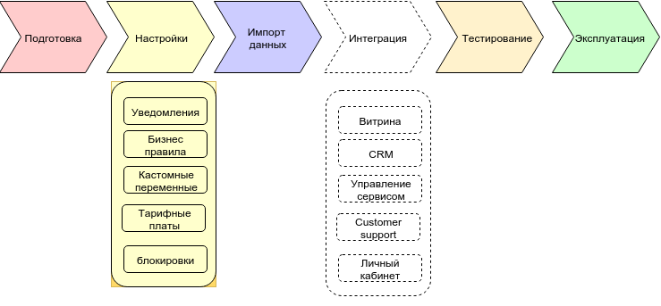

Типовые этапы внедрения системы
=======

# Введение

Отличительной чертой биллинговой системы ПрайсПлан является высокая готовность к использованию, а также возможность настроить правила работы системы без программирования.

Типовые шаги внедрения биллинговой системы ПрайсПлан включают:

1. Описание бизнес модели;
2. Настройку системы;
3. Тестирование;
4. Интеграцию (при необходимости).



# Описание бизнес модели

На данном этапе необходимо провести анализ вашей бизнес модели, описать текущие продукты (тарифы), выявить наличие дополнительных услуг (определить являются ли они самостоятельными или входят в какой-либо тариф), определить набор условий и действий которые сопровождают то или иное событие (например: что происходит после оплаты счета, когда производится актирование и т.д.), выделить исключения (например для VIP клиентов есть определенные привилегии или свои правила работы с ними).

После составления описания бизнес модели, можно переходить к настройке системы.

# Настройка системы ПрайсПлан

## Тарифные планы

Процесс создания тарифных планов подробно описан в документации пользователя и в обучающем видео ролике. 
Особое внимание стоит обратить на ценообразующие переменные продукта. 

* решите, будете ли вы брать оплату в первом счете (например, установка и настройка)
* разделите предоставляемые вами услуги по форме оплаты;
  * предоплата, 
  * постоплата (по факту использования). Хорошим примером  является отребленный интернет трафик или количество отправленных CMC за период.  

## Настройки аккаунта

Подробное описание всех настроек системы есть в документации пользователя и в обучающем видео ролике. Используйте документацию или обратитесь к нам за консультацией если значение какой-то настройки непонятно.

## Шаблоны уведомлений

Шаблоны документов используются в PricePlan формирования email, CMC, печатных форм, а также,  внутренних уведомлений пользователям системы Подробное описание создания шаблонов уведомлений есть в документации пользователя.

## Шаблоны закрывающих документов

В PricePlan уже есть шаблоны наиболее часто используемых финансовых документов: счета на оплату, акта об оказании услуг, счета-фактуры. Вы можете изменить шаблоны документов по вашему усмотрению (например добавить в счет и акт текст вашего договора - оферты) 

## Нумерация документов

Вы можете использовать шаблоны нумерации документов, заданные в системе по умолчанию, или изменить их на удобные вам.  Ссылка на документацию.

## Кастомные переменные

PricePlan дает возможность добавлять кастомные переменные к клиентам, продуктам и подпискам. Эти переменные отображаются во всех списках, индексируются в поиске и, само важное то, что они становятся доступны в бизнес правилах. Вы можете проверять значения переменной в условиях и присваивать значения в действиях правила. Документация: 

- http://docs.priceplan.pro/userguide/#/nastroiki_sistemi/polya_yuridicheskoe_litso


- http://docs.priceplan.pro/userguide/#/nastroiki_sistemi/polya_fizicheskoe_litso


- http://docs.priceplan.pro/userguide/#/nastroiki_sistemi/peremennie

## Настройка бизнес правил

Возможно вы обратили внимание на то что в самом начале работы в разделе “бизнес правила” уже создано несколько десятков правил, однако при создании аккаунта мы обычно ничего не знаем о вашей модели бизнеса, поэтому бизнес правила, которые вы видите в песочнице созданы скорее для демонстрации возможностей системы нежели для реальной работы. Вам обязательно нужно будет понять, как работают правила, возможно изменить их или дополнить список правил, в соответствии с принципами функционирования вашего бизнеса.
Опишите, что должна делать система биллинга при обработке каждого из доступных событий. Эта работа может занять длительное время, но она необходима, для создания модели вашего бизнеса в системе PricePlan. Несколько примеров:

```Пример 1. После успешной регистрации счета послать уведомление клиенту по шаблону “Добро пожаловать в сервис XXX!”. Создайте список всех уведомлений вашим клиентам, которые будут отправляться по правилам PricePlan. Какое уведомление должен получить ваш клиент после пополнения баланса? Отмены подписки?```

```Пример 2.  В зависимости от того, по какой модели работает ваша компания, создайте правило на событие ”после зачисления средств на баланс”. Средства могут быть сразу же списаны (автоматически продлить все подписки) или вы можете держать их на балансе не трогая до конца оплаченного периода.```

```Пример 3. Отобразите в правилах, что должен делать биллинг при окончании срока оплаченного периода в случае если на балансе достаточно средств для продления. Создайте отдельное правило обработки события если средств на балансе недостаточно.``` 

```Пример 4. Клиент уже 3 дня заблокирован за неуплату и в это время на баланс поступили средства. Логично будет сразу же подлить подписку и списать средства с баланса, но сколько в вашей компании стоят “заблокированные” 3 дня? Полную стоимость, бесплатно или что то посередине?.```

Разные правила PricePlan могут быть настроены на событие продление подписки для разных сценариев 

## Настройка правил кредитного контроля

Особое внимание стоит обратить на настройку правил кредитного контроля. В системе PricePlan эти правила задаются в модуле бизнес правил.
Решите,  может ли баланс ваших клиентов уходить в минус и на какую сумму? В правилах PricePlan вы можете настроить кредитный контроль по разному для разных типов клиентов.  
Если вы работаете по кредитной системе то необходимо решить, через какое время после выставления счета за оказанные услуги,  должна возникать дебиторская задолженность.
Если вы работаете по предоплате, то нужно решить продолжите ли вы предоставлять услуги без необходимых средств на балансе.
Какие условия должны возникнуть для прекращения оказания услуг (создания блокировки по нехватке средств)?
##Бизнес правила: блокировки
В каких случаях вы откажете вашим клиентам о оказании услуг? В каких случаях предоставление сервиса возобновиться?  

Для реализации этого функционала в PricePlan существует механизм блокировок. 
В качестве примера можно взглянуть на правило “Блокировка при нехватке средств”, созданное на событие “После создания подписки”. Смысл того правила в том, что PricePlan блокирует любую новую подписку до момента ее оплаты (поступления средств). Вы можете установить свои блокировки в правилах или вручную.  
Например “не блокировать VIP клиентов при нехватке средств а вместо этого уведомлять менеджера о необходимости позвонить клиенту и напомнить о задолженности.” 
В PricePlan можно создавать любое количество блокировок разного типа. Например: “Недостаточно средств”, “В ожидании дополнительной информации”, “По просьбе клиента”. Каждая из них может обрабатываться разными правилами.  
** Важно понимать, что на данном тапе внедрения PricePlan пока не интегрирован с вашим сервисом и созданные блокировки не будут автоматически блокировать доступ к сервису **, однако они будут видны в интерфейсе и в личном кабинете клиента.  

Блокировки – очень важный механизм оперативного и финансового контроля в биллинге. Используйте их!

## СМС уведомления

Решите, будете ли вы использовать уведомления по СМС. В PricePlan есть возможность уведомлять клиетов по СМС. Уведомления рассылаются в действиях правил, аналогично тому как работают уведомления  по электронной почте. 
СМС уведомления - платная дополнительная услуга. Стоимость указана в вашем договоре или узнайте ее у нашего менеджера.

# Бизнес правила: Счета и закрывающие документы

Работа со счетами и  закрывающими документами также настраивается в разделе “Бизнес правила”. Если вы работаете с юридическими лицами, вам  внимание нужно ответить на вопросы:
когда выставлять счет за предоплату следующего периода?
когда высылать клиетам (юрлицам) закрывающие документы? 
В конце каждого месяца? 
Сразу после списания средств? 
В конце периода?
И создать бизнес правила в соответствии с вашими требованиями.

Несмотря на то, что закрывающие документы физ. лицам обычно не высылаются вы можете (например) принять решение высылать физическим лицам детализированный отчет в конце каждого месяца. Для этого вам нужно будет создать шаблон документа и дать команду на создание рассылку в правилах (например, на закрытие месяца)
#Бизнес правила: Работа с дебиторской задолженностью.
Возможность предоставлять товары и услуги на условиях отсрочки платежа всегда является важным конкурентным преимуществом. Однако, дебиторская задолженность нуждается в постоянном управлении для эффективного использования. В PricePlan существует концепция “старения задолженности”, которая позволяет настроить автоматические цепочки писем – напоминаний, а также других действий, привязанных к возрасту задолженности (например,  отправить уведомление менеджеру или передать данные в юридический отдел).  

# Бизнес правила: В заключение.

Несколько общих советов по настройке работы PricePlan режиме песочницы:
Все данные, которые вы создали в песочнице будут сохранены при переходе на платный план.
Не торопитесь. Работа в песочнице не ограничена по времени. Ваш аккаунт будет гарантировано  активен в течение года с даты последнего посещения.
Мы всегда готовы помочь. Позвоните вашему менеджеру и он поможет с настройками.

# Импорт клиентов

При начале работы в системе вы увидите список из 25 клиентов, состоящий из юридических и физических лиц. Вы можете тестировать бизнес правила на этом списке, но перед переходом в боевой режим мы советуем загрузить реальных клиентов и еще раз протестировать все сценарии. Для этого в PricePlan существует простой функционал загрузки клиентов из текстового файла. 

Подробно процесс импорта клиентов описан в документации.

При работе в песочнице существует лимит в 50 клиентов. Если вам для тестирования нужно увеличить это лимит – напишите письмо с просьбой в службу поддержки: support@priceplan.pro

# Импорт подписок

Для клиентов, уже заключивших договоры на момент внедрения биллинга существует возможность импорта подписок в PricePlan.
Импорт подписок дает возможность загрузить тарифный план и дату продления для каждой подписки и тем самым обеспечивает возможность начала работы PricePlan в любой момент без потери данных.

Подробно процесс импорта подписок описан в документации.

# Тестирование настроек в песочнице с помощью “машины времени”

После того как все настроено, необходимо протестировать бизнес правила со всеми возможными сценариями. Для этого в песочнице создана функция “перемещения во времени”.

Методология тестирования PriсePlan предполагает, что документируете вводные данные для каждого сценария и ожидаемые результаты на определенную дату времени. 

После того необходимо ввести вводные данные в PricePlan и переместиться в определенную дату вперед в “будущее”. После этого сравнить результаты работы биллинга с ожидаемыми.

Если что-то сработало не так, и результаты не совпадают с ожидаемыми то нужно установить причину, поправить правила, вернуться в “сегодняшний” день и начать тестирование сценария заново.

# Интеграция

В системе ПрайсПлан есть несколько готовых модулей интеграции, помимо этого разработано API для интеграции с любыми сторонними сервисами. Описание API.

## Интеграция с витриной тарифных планов

Интеграция со страницей подписки на тарифные планы предполагает передачу в PricePlan информации о новом клиенте и о параметрах заказанного продукта. Типовая интеграция может быть выполнена двумя способами: 

1. После того как пользователь выбрал тарифный план, вы перебрасываете его на промежуточную страницу PricePlan (возможна стилизация страницы вашим CSS). На той странице пользователь подтверждает выбор продукта и всех опций, после чего PricePlan перебрасывает пользователя обратно на ваш сайт (страницу подтверждения успешной регистрации).
2. Пользователь не покидает ваш сайт, а после выбора продукта вы вызываете API создание пользователя и подписки.   
  
   ## Интеграция с вашим сервисом

Предполагается, что Ваш сервис будет вызывать API биллинга при попытке получения доступа к вашим услугам и проверять наличие блокировок. Обычно, если количество блокировок подписки > 0 то:

1. В доступе к вашему сервису должно быть  отказано
2. Желательно показать пользователю причину отказа (это доступно в API).

Так же возможна более глубокая интеграция, в которой ваш сервис будет сверять лимиты ресурсов, ограниченных тарифным планом с их фактическим использованием. 
Например, если количество рабочих мест в подписке ограничено 10ю, то при попытке создания нового рабочего места вы сможете вызвать API PricePlan и сравнить реально использованное кол-во рабочих мест с максимально возможным. Если ваш клиент превысил лимит то вы сможете вывести сообщение о необходимости перейти на другой тарифный план или приобретении дополнительного пакета лицензий.
Таким образом ваш пользователь может быть сразу перенаправлен в личный кабинет где сможет мгновенно оплатить  дополнительный пакет лицензий и сразу после этого начать создавать новые рабочие места в вашем сервисе. 

## Интеграция с платежными системами

Интеграция с платежными системами подробно описана в руководстве пользователя. PricePlan использует настройки вашего аккаунта в платежной системе для автоматического зачисления средств на лицевые счета клиентов. 

PricePlan не является платежной системой и для возможности принимать платежи по кредитным картам вам потребуется заключить договор с платежной системой вашего выбора.

Если ваша платежная система поддерживает безакцептные списания, то вы можете настроить такие списания в модуле правил PricePlan, после чего при каждом продлении подписки средства будут автоматически списываться с кредитной карты пользователя.

## Интеграция с CRM

В PricePlan заложены базовые функции CRM системы и вы, безусловно можете использовать PricePlan как CRM, однако интеграция с полноценной CRM системой может быть необходима по многим причинам. 

Архитектура PricePlan поддерживает двустороннюю интеграцию. Pull – через вызов API PricePlan и push через Webhooks и Бизнес правила.
Простейшим примером интеграции может быть передача данных о каждом новом клиенте из биллинга в CRM через вызов Webhook в правиле на событие “после создания клиента”.
Интеграция с системой поддержки пользователей
Архитектура PricePlan поддерживает двустороннюю интеграцию. Pull – через вызов API PricePlan и push через Wеbhooks и Бизнес правила. Кроме того, возможно интеграция на уровне интерфейса. 
Примером интеграции может быть отображение списка открытых заявок клиента в личном кабинете и возможности создать новую заявку прямо из личного кабинета. 
Передайте название вашей системы техподдержки и требования по интеграции нашему менеджеру и мы предложим оптимальное решение.

## Интеграция ERP

В поставке PricePlan есть модуль интеграции с “1С Бухгалтерия предприятия 3.0” выполненный в форме внешней обработки 1С с открытым кодом. 

Интеграция с 1С двусторонняя. В 1С выгружаются счета и все зарывающие документы, а из 1С возможно получить платежи контрагентов. Это удобно для зачисления на баланс платежей юридических лиц. Интеграция с 1С подробно описана в документации пользователя и  обучающем видео 

Если в вашей организации используется другая система финансовой отчетности – передайте информацию  о ней нашему менеджеру и мы предложим оптимальное решение.
##Доработка личного кабинета пользователя
В поставку  PricePlan входит личный кабинет пользователя с фунциями самообслуживания:

* просмотра баланса лицевого счета
* пополнения баланса
* расчета суммы, необходимой для продления подписки
* добавление новых услуг
* изменение параметров текущей подписки
* ереход с одной подписки на другую

Личный кабинет может интегрировать в себя функции провижининга и управления вашим сервисом,  либо интегриваться в уже существующий личный кабинет (ели он у вас есть).

Интеграция может быть произведена через API\Webhooks или через iframe.

Личный кабинет также может включать в себя функционал внешнего интерфейса вашей системы тех поддержки. Интеграция с ней описана выше.

# Перевод ситемы в "боевой" режим

Время, требуемое на настойку, тестирование и интеграцию биллинга зависит от ваших требований к конечной системе. Это может быть несколько дней в самом простом случае или несколько месяцев в сложном. 

Мы готовы предоставить помощь в:

* составлении технического задания
* управлении проектом
* внедрением системы под ключ

После того, как вы прошли все нужные вам шаги внедрения, система настроена и протестирована, можно переходить в “боевой режим”.

## Выбор режима работы биллинга.

PricePlan может работать в одном из двух режимов: "С подтверждением" или "Полный автомат". Подробнее 

Мы рекомендуем, использовать режим "с подтверждением" первые 2-3 месяца после начала эксплуатации биллинга и переключиться на режим "полный автомат", только после полной уверенности в безошибочной работе всех правил.

## Техническая поддержка в процессе эксплуатации.

Мы делаем все возможное, чтобы система работала без сбоев и системных ошибок, однако периодически ошибки ошибки возникают в любой системе. 

Системные ошибки. Если вы используете PricePlan как сервис, то все системные ошибки попадают в нашу систему мониторинга и скорее всего мы знаем об ошибке и работаем над ее исправлением. Вы можете отправить описание ошибки на адрес support@priceplan.pro для возможности контролировать сроки исправления по номеру заявки.

Ошибки настройки правил. Ошибки могут возникнуть из за того, что во время тестирования не все сценарии были протестированы и при некоторых сценариях биллинг может не выполнить определенные действия или выполнить что то лишнее. Для расследования таких случаев существует лог системных действий, доступный в меню клиента.
Вы также можете отправить подробное описание ошибки на адрес support@priceplan.pro и ваш менеджер поможет разобраться с настройкой правил.
